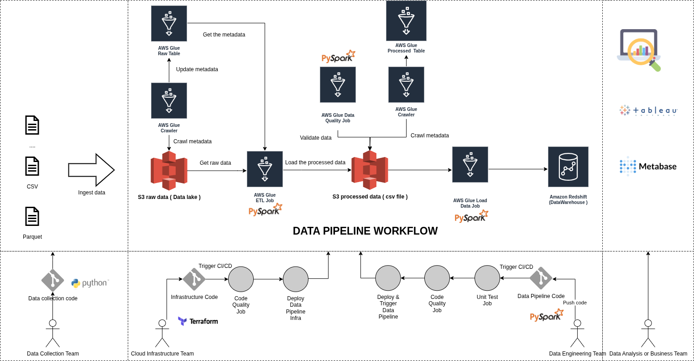

# Nash DataOps Terraform Infrastructure

This repository contains the Infrastructure as Code (IaC) components for the Nash DataOps ETL pipeline using AWS Glue, S3, and Amazon Redshift.

## Architecture

The infrastructure implements a complete data pipeline:



## Project Structure

- `/terraform` - Core Terraform configuration files
  - `main.tf` - Core AWS resources and provider configuration
  - `variables.tf` - Input variables for customization
  - `terraform.tfvars` - Variable values for the configuration
  - `glue_catalog.tf` - Defines the Glue Data Catalog resources
  - `glue_process_raw_data_job.tf` - Glue job for processing raw data
  - `glue_validate_data_job.tf` - Glue job for validating data
  - `glue_load_data_to_redshift_job.tf` - Glue job for loading data into Redshift
  - `glue_workflow.tf` - Defines the Glue workflow to orchestrate the jobs
- `/metabase` - Metabase analytics platform configuration with Docker Compose
- `/data` - Sample data files and templates
- `/media` - Contains media files, such as architecture diagrams

## Data pipeline Workflow

The deployed infrastructure creates an AWS Glue Workflow that orchestrates a series of jobs to process data from ingestion to analytics:

1. **Ingest Data**: Raw data files (e.g., CSV, Parquet) are uploaded to an S3 bucket which serves as a data lake.
2. **Crawl Raw Data**: An AWS Glue Crawler scans the raw data in S3 and updates the metadata in the AWS Glue Data Catalog, creating or updating a "raw table".
3. **Process Raw Data**: An AWS Glue ETL job, written in PySpark, transforms the raw data. This includes cleaning, joining, and enriching the data, which is then written to a separate "processed" S3 bucket.
4. **Validate Data Quality**: An AWS Glue Data Quality job runs checks on the processed data to ensure it meets defined standards and rules.
5. **Crawl Processed Data**: A second AWS Glue Crawler scans the processed data in S3 to update the Glue Data Catalog with the schema of the clean data.
6. **Load to Data Warehouse**: An AWS Glue job loads the final, processed data from S3 into an Amazon Redshift data warehouse.
7. **Analytics and Visualization**: The data in Redshift is now ready for consumption by business intelligence tools like Metabase and Tableau for analysis and reporting.

## Setup and Deployment

1. **Prerequisites**:
   - AWS CLI installed and configured the profile name as `cloud-user` with your AWS credentials
   - Terraform installed (v1.0+)
   - AWS account with appropriate permissions
   - Add `terraform.tfvars` file in the `terraform` directory with the required variables and change the values as per your environment
   ```yaml
      # Terraform variables for AWS Glue ETL Demo

      # AWS Region where resources will be deployed
      region = "ap-southeast-1"

      # S3 bucket name for storing data and scripts
      # Note: S3 bucket names must be globally unique
      data_bucket_name = "dataops-glue-etl-demo-data-bucket-dev"

      # Environment tag (dev, staging, or prod)
      environment = "dev"

      # Redshift credentials
      # Note: These should be secured using a secrets manager in production
      redshift_username = "admin"
      redshift_password = "StrongPassword123!" # In production, use a more secure method

      # Common tags to apply to all resources
      tags = {
         Owner      = "DataOps-Team"
         Project    = "ETL-Demo"
         CostCenter = "DataEngineering"
      }
   ```

2. **Deploy Infrastructure**:
   ```bash
   export AWS_PROFILE=cloud-user

   # Change your bucket name as per your environment and update the bucket name in main.tf file
   aws s3 mb s3://dataops-glue-etl-demo-tfstate --region ap-southeast-1
   cd terraform
   terraform init
   terraform apply
   ```

3. **Configure Metabase**:
   ```bash
   cd metabase
   docker-compose up -d
   ```

## Terraform Components

This project provisions the following key AWS resources using Terraform:

- **Amazon S3 Buckets**: Securely stores raw data, processed data, and ETL scripts.
- **AWS Glue Data Catalog**: A centralized metadata repository, including a database and crawlers for discovering the schema of both raw and processed data.
- **AWS Glue Jobs**: A series of serverless ETL jobs to:
  - Process raw data using PySpark.
  - Validate the quality of the processed data.
  - Manage the schema of the Redshift data warehouse.
  - Load the final, clean data into Redshift.
- **AWS Glue Workflow**: Orchestrates the entire data pipeline, using triggers to chain jobs and crawlers together in the correct sequence.
- **IAM Roles and Policies**: Provides fine-grained permissions for AWS services to interact with each other securely, following the principle of least privilege.
- **Amazon Redshift Cluster**: A fully managed data warehouse for high-performance analytics and business intelligence.
- **CloudWatch Alarms and Log Groups**: For monitoring the pipeline's health, logging job outputs, and sending notifications if issues arise.

## Metabase Analytics

The `/metabase` directory contains a Docker Compose setup for running Metabase, an open-source analytics and visualization tool:

- Connects to Redshift to visualize the processed data
- Provides dashboards and ad-hoc query capabilities
- Runs in Docker for easy deployment
- Persistent storage configuration included

## Resource Cleanup

To remove all created resources:

```bash
cd terraform
terraform destroy
```

This will delete all AWS resources created by this project, including S3 buckets, Glue jobs, and the Redshift cluster.